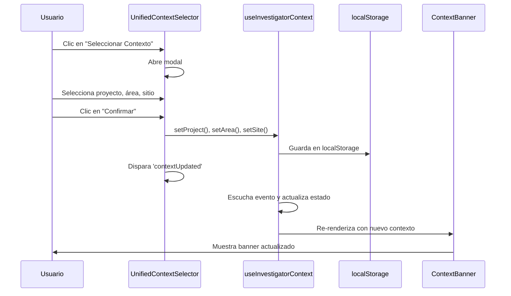
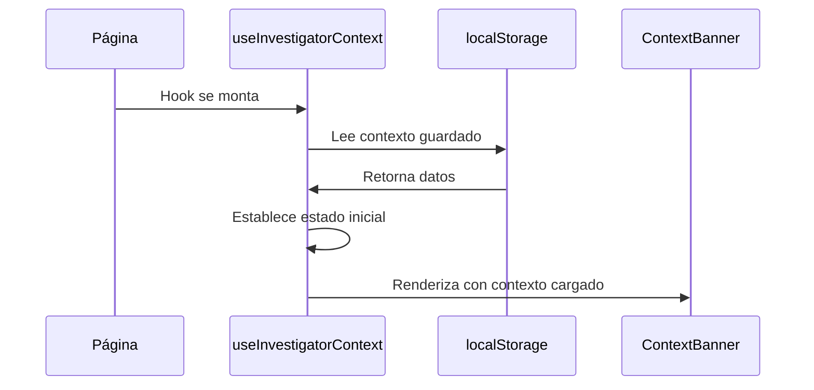

# 📋 SISTEMA DE CONTEXTO ARQUEOLÓGICO - INFORME TÉCNICO

## 🎯 Resumen Ejecutivo

El sistema de contexto arqueológico permite a los investigadores establecer y mantener un contexto de trabajo que incluye **Proyecto**, **Área** y **Sitio**. Este contexto afecta la habilitación de herramientas y se muestra visualmente en un banner en la parte superior de todas las páginas del investigador.

## 🏗️ Arquitectura del Sistema

### Componentes Principales

1. **`useInvestigatorContext`** - Hook principal para gestión de contexto
2. **`ContextBanner`** - Componente visual que muestra el estado del contexto
3. **`UnifiedContextSelector`** - Selector modal para cambiar el contexto
4. **Layout del Investigador** - Contiene el banner de contexto

### Flujo de Datos

```
localStorage ←→ useInvestigatorContext ←→ ContextBanner
                    ↓
            UnifiedContextSelector
                    ↓
            CustomEvent('contextUpdated')
```

## 📁 Estructura de Archivos

### Archivos Principales

```
frontend-web/src/
├── hooks/
│   └── useInvestigatorContext.ts          # Hook principal de contexto
├── components/ui/
│   ├── ContextBanner.tsx                  # Banner visual de contexto
│   └── UnifiedContextSelector.tsx         # Selector modal de contexto
├── app/dashboard/researcher/
│   ├── layout.tsx                         # Layout con banner (ÚNICO lugar)
│   └── page.tsx                           # Dashboard principal (SIN banner)
└── contexts/
    └── AuthContext.tsx                    # Contexto de autenticación
```

## 🔧 Implementación Técnica

### 1. Hook `useInvestigatorContext`

**Ubicación:** `frontend-web/src/hooks/useInvestigatorContext.ts`

**Funcionalidad:**
- Gestiona el estado del contexto (proyecto, área, sitio)
- Persiste datos en `localStorage` bajo la clave `investigator-context`
- Proporciona funciones para establecer y limpiar contexto
- Escucha eventos personalizados para actualizaciones

**Interfaz:**
```typescript
interface UseInvestigatorContextReturn {
  context: InvestigatorContext;           // Estado actual del contexto
  setContext: (context: InvestigatorContext) => void;
  setProject: (project: string) => void;
  setArea: (area: string) => void;
  setSite: (site: string) => void;
  clearContext: () => void;
  hasContext: boolean;                    // ¿Tiene proyecto Y área?
  isLoading: boolean;                     // Estado de carga
}
```

**Estructura de Datos:**
```typescript
interface InvestigatorContext {
  project: string;  // Nombre del proyecto
  area: string;     // Nombre del área
  site: string;     // Nombre del sitio (opcional)
}
```

**Eventos Escuchados:**
- `contextUpdated` - Disparado por `UnifiedContextSelector` cuando se confirma una selección

### 2. Componente `ContextBanner`

**Ubicación:** `frontend-web/src/components/ui/ContextBanner.tsx`

**Funcionalidad:**
- Muestra visualmente el estado del contexto
- Cambia de color según el estado (amarillo = sin contexto, verde = completo, azul = parcial)
- Se renderiza **ÚNICAMENTE** en el layout del investigador

**Estados Visuales:**
- **Sin contexto:** Banner amarillo con advertencia
- **Contexto parcial:** Banner azul (proyecto + área)
- **Contexto completo:** Banner verde (proyecto + área + sitio)

**Lógica de Renderizado:**
```typescript
const isContextComplete = useMemo(() => 
  Boolean(context.project && context.area && context.site), 
  [context.project, context.area, context.site]
);
```

### 3. Componente `UnifiedContextSelector`

**Ubicación:** `frontend-web/src/components/ui/UnifiedContextSelector.tsx`

**Funcionalidad:**
- Modal para seleccionar proyecto, área y sitio
- Usa `useInvestigatorContext` para guardar cambios
- Dispara evento `contextUpdated` después de confirmar

**Flujo de Selección:**
1. Usuario hace clic en "📍 Seleccionar Contexto"
2. Se abre modal con selectores
3. Usuario selecciona proyecto → área → sitio
4. Usuario confirma con "Confirmar"
5. Se guarda en `localStorage`
6. Se dispara evento `contextUpdated`
7. Se cierra modal

### 4. Layout del Investigador

**Ubicación:** `frontend-web/src/app/dashboard/researcher/layout.tsx`

**Funcionalidad:**
- **ÚNICO lugar** donde se renderiza `ContextBanner`
- Se aplica a todas las páginas del investigador
- Evita duplicación de banners

**Implementación:**
```tsx
import ContextBanner from '../../../components/ui/ContextBanner';

export default function ResearcherLayout({ children }) {
  return (
    <div>
      <ContextBanner />  {/* ÚNICO banner de contexto */}
      {children}
    </div>
  );
}
```

## 🎮 Lógica de Habilitación de Herramientas

### Criterios de Habilitación

**Ubicación:** `frontend-web/src/app/dashboard/researcher/page.tsx`

**Lógica:**
```typescript
// Contexto mínimo: proyecto + área
const hasMinimalContext = Boolean(investigatorContext.project && investigatorContext.area);

// Contexto completo: proyecto + área + sitio
const hasCompleteContext = Boolean(investigatorContext.project && investigatorContext.area && investigatorContext.site);

// Herramientas básicas: requieren contexto mínimo
const isBasicToolEnabled = hasMinimalContext;

// Herramientas avanzadas (como Mapeo SIG): requieren contexto completo
const isAdvancedToolEnabled = hasCompleteContext;
```

**Herramientas por Categoría:**

| Herramienta | Requisito | Estado |
|-------------|-----------|---------|
| Trabajo de Campo | Contexto mínimo | ✅ Habilitada con proyecto + área |
| Hallazgos | Contexto mínimo | ✅ Habilitada con proyecto + área |
| Muestras | Contexto mínimo | ✅ Habilitada con proyecto + área |
| Laboratorio | Contexto mínimo | ✅ Habilitada con proyecto + área |
| Cronología | Contexto mínimo | ✅ Habilitada con proyecto + área |
| Reportes | Contexto mínimo | ✅ Habilitada con proyecto + área |
| Exportar Datos | Contexto mínimo | ✅ Habilitada con proyecto + área |
| **Mapeo SIG Integrado** | **Contexto completo** | ✅ **Habilitada solo con proyecto + área + sitio** |

## 🔄 Flujo de Actualización de Contexto

### 1. Selección de Contexto



### 2. Carga Inicial



## 🚨 Puntos Críticos y Precauciones

### ⚠️ Reglas Importantes

1. **Banner Único:** `ContextBanner` debe renderizarse **SOLO** en el layout del investigador
2. **No Duplicación:** Evitar importar `ContextBanner` en páginas individuales
3. **Hook Único:** Usar `useInvestigatorContext` en lugar de otros hooks de contexto
4. **Eventos:** El evento `contextUpdated` es crucial para la sincronización

### 🔧 Posibles Problemas

1. **Duplicación de Banner:**
   - **Síntoma:** Múltiples banners verdes aparecen
   - **Causa:** `ContextBanner` importado en múltiples lugares
   - **Solución:** Mantener solo en layout

2. **Contexto No Se Actualiza:**
   - **Síntoma:** Banner no cambia después de seleccionar contexto
   - **Causa:** Evento `contextUpdated` no se dispara
   - **Solución:** Verificar `handleConfirm` en `UnifiedContextSelector`

3. **Herramientas No Se Habilitan:**
   - **Síntoma:** Herramientas permanecen deshabilitadas
   - **Causa:** Lógica de `hasMinimalContext` o `hasCompleteContext` incorrecta
   - **Solución:** Verificar valores en `investigatorContext`

4. **Bucle Infinito de Re-renderizados:**
   - **Síntoma:** `ContextBanner` se renderiza constantemente
   - **Causa:** Dependencias incorrectas en `useEffect`
   - **Solución:** Usar `useMemo` y dependencias vacías `[]`

## 🧪 Scripts de Prueba

### Scripts Disponibles

1. **`scripts/test_context_banner.js`** - Prueba completa del sistema
2. **`scripts/check_banner_duplication.js`** - Verifica duplicación de banners
3. **`scripts/check_banner_logs.js`** - Verifica logs de renderizado

### Ejecutar Pruebas

```bash
# Prueba completa del sistema
node scripts/test_context_banner.js

# Verificar duplicación
node scripts/check_banner_duplication.js

# Verificar logs
node scripts/check_banner_logs.js
```

## 📊 Estado Actual Verificado

### ✅ Funcionalidades Confirmadas

- [x] Banner se muestra correctamente sin duplicación
- [x] Contexto se carga desde localStorage al iniciar
- [x] Selector de contexto funciona correctamente
- [x] Herramientas se habilitan según el contexto
- [x] Evento `contextUpdated` sincroniza cambios
- [x] Persistencia de datos funciona correctamente
- [x] Navegación entre herramientas funciona

### 📈 Métricas de Rendimiento

- **Tiempo de carga inicial:** ~2-3 segundos
- **Tiempo de actualización de contexto:** <1 segundo
- **Re-renderizados del banner:** 1 por cambio de contexto
- **Tamaño del estado:** ~200 bytes en localStorage

## 🔮 Mantenimiento y Evolución

### Modificaciones Seguras

1. **Cambiar colores del banner:** Modificar clases CSS en `ContextBanner`
2. **Agregar nuevas herramientas:** Actualizar array `researchTools` en dashboard
3. **Cambiar criterios de habilitación:** Modificar lógica de `hasMinimalContext`/`hasCompleteContext`

### Modificaciones Peligrosas

1. **Cambiar estructura de datos:** Requiere migración de localStorage
2. **Modificar eventos:** Puede romper sincronización
3. **Mover banner:** Puede causar duplicación

### Checklist para Cambios

- [ ] Verificar que `ContextBanner` solo esté en layout
- [ ] Probar selección de contexto completa
- [ ] Verificar habilitación de herramientas
- [ ] Ejecutar scripts de prueba
- [ ] Verificar persistencia en localStorage

## 📞 Contacto y Soporte

Si se rompe el sistema de contexto:

1. **Revisar logs** del navegador para errores
2. **Ejecutar scripts de prueba** para diagnóstico
3. **Verificar localStorage** con `localStorage.getItem('investigator-context')`
4. **Revisar este documento** para entender la implementación

---

**Última actualización:** Enero 2025  
**Versión del sistema:** 1.0  
**Estado:** ✅ Funcionando correctamente 